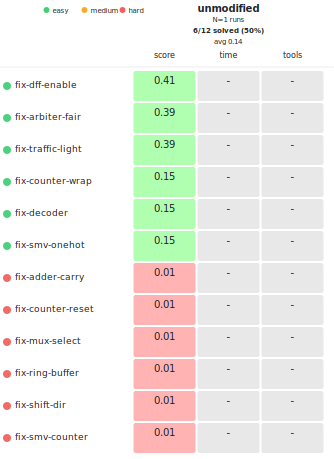

# Formal Hardware Verification

An RL training environment for formal hardware verification using EBMC (hw-cbmc). 40 tasks across SystemVerilog circuit debugging, NuSMV model fixing, and protocol FSM implementation — calibrated so frontier models score 0.0–1.0 with meaningful variance.

**What this trains:** An agent that can read a buggy hardware description, understand formal properties, trace multi-cycle counterexamples from EBMC, identify wiring/routing/timing bugs in complex pipelines, and write correct fixes. The agent must reason about non-blocking assignment semantics, pipeline forwarding, feedback loops, and protocol handshakes — not just pattern-match algorithms.

## Why Formal Hardware Verification?

EBMC is a bounded model checker: it exhaustively explores all reachable states up to a given bound and mathematically proves or refutes properties. A property either **PROVES** (holds for all inputs across all time steps) or is **REFUTED** (a concrete counterexample is found). This makes correctness guarantees far stronger than simulation tests.

The hard tasks require debugging circuits with **3–4 interacting wiring bugs** in feedback paths — fixing one bug changes the symptoms of the others. This forces iterative debugging: run EBMC → read counterexample → fix one bug → re-run → discover new failure → repeat. Frontier models (Sonnet 4.6, Gemini 2.5 Flash) consistently fail on these tasks.

## Tasks

40 tasks in 3 difficulty tiers.

### Hard (10 tasks) — Complex microarchitectural circuits with interacting bugs

| Task | Circuit | Bugs | Properties | Bound |
|------|---------|------|------------|-------|
| **fix-scoreboard-bypass** | Pipeline with RAW hazard bypass | 4 (condition/mux/operand/dest) | 8 | 10 |
| **fix-cache-ctrl** | Direct-mapped write-back cache | 3 (writeback index/fill source/read output) | 7 | 8 |
| **fix-branch-pred** | 2-bit saturating counter predictor | 3 (table index/threshold/update direction) | 7 | 10 |
| **fix-dma-engine** | 2-channel DMA with round-robin | 3 (address source/turn flip/completion check) | 7 | 12 |
| **fix-regfile-fwd** | Dual-read regfile with write forwarding | 3 (forward condition/RMW operation/read routing) | 7 | 8 |
| **fix-hazard-ctrl** | 3-stage pipeline hazard detector | 3 (hazard compare/stall signal/forward mux) | 7 | 10 |
| **fix-arb-lock** | Bus arbiter with lock/burst/priority | 3 (burst load/burst decrement/lock acquisition) | 7 | 10 |
| **fix-fifo-async** | Async FIFO with Gray-code pointers | 3 (Gray encode/full detect/sync stages) | 7 | 10 |
| **fix-timer-irq** | Dual-compare timer with prescaler | 3 (mask polarity/compare source/compare target) | 7 | 15 |
| **fix-mem-ctrl** | Memory controller with bank interleaving | 3 (bank select/pending track/response mux) | 7 | 10 |

### Medium (9 tasks) — Protocol FSMs and iterative algorithms

| Task | Type | Properties | Description |
|------|------|------------|-------------|
| fix-pipeline-alu | fix | 5 | 2-stage ALU pipeline with swapped latch targets and wrong opcode source |
| fix-restoring-div | fix | 5 | 8-bit restoring division with wrong shift direction and off-by-one step |
| fix-fifo-ptrs | fix | 7 | 8-entry FIFO with wrong write address and pointer routing |
| fix-fifo-credit | fix | 7 | Credit-based FIFO with wrong register updates |
| fix-pipeline-mac | fix | 6 | 3-stage MAC pipeline with wrong operand and clear routing |
| fix-uart-rx | fix | 6 | UART 4N1 receiver with wrong data source and assembly |
| fix-i2c-ctrl | fix | 6 | I2C master with wrong bit index and ACK signal source |
| fix-booth-mul | fix | 6 | Booth radix-2 multiplier with wrong shift tap and commit timing |
| implement-axi-handshake | implement | 6 | AXI-lite write FSM from scratch with assume constraints |

### Easy (21 tasks) — Single-bug circuits and simple FSMs

Combinational (bound=1): fix-decoder, fix-mux-select, fix-adder-carry, fix-priority-enc, fix-hamming, fix-barrel-shift

Sequential (bound=10–20): fix-counter-reset, fix-counter-wrap, fix-shift-dir, fix-dff-enable, fix-fibonacci, fix-lfsr, fix-gray-counter, fix-watchdog, fix-crc8, fix-spi-slave, fix-ring-buffer, fix-traffic-light, fix-arbiter-fair, implement-arb3

NuSMV (bound=10–20): fix-smv-counter, fix-smv-onehot, fix-smv-ring3, fix-smv-mod8

## Scoring

Every task produces a float in [0, 1] from a deterministic oracle. No LLM-as-judge.

**Formula:** `sigmoid(scale * (proved_fraction - center))`

| Component | Description |
|-----------|-------------|
| **proved_fraction** | Properties proved / total properties [0, 1] |
| **sigmoid_center** | Per-task calibration (0.55–0.95) |
| **sigmoid_scale** | Per-task steepness (8–20) |

**Anti-cheat layers:**
- Assertion body hash — SHA256 of all `assert property` lines; any modification → score 0
- Module signature check — port list must match config
- Assume/restrict injection detection (with whitelist for given environmental constraints)
- Synthesis translate_off detection
- Property count verification

## Hints

Hard tasks include optional `// HINT:` comments near the most subtle bugs. These are stripped by default during evaluation. To run with hints enabled, pass `--with-hints` to the dryrun runner (if supported) or manually preserve `// HINT:` lines in the student files.

## Student Tools

The student agent operates in a sandboxed bash environment with three tools:

| Tool | What it does |
|------|-------------|
| `bash` | Run shell commands. Read files, run tests, check output. |
| `view_lines_in_file` | Read specific line ranges from a file. |
| `replace_in_file` | Edit a file by replacing an exact string match. |

The student can read `/workdir/data/` (workspace) and `/workdir/shared/` (reference). It cannot read `/root_data/` (scoring, configs).

Typical workflow:

1. Read the task file in `/workdir/data/`
2. Edit it using `replace_in_file`
3. Verify using `bash`

## Setup

Requires Docker. No GPU or special hardware.

```bash
./run.sh build    # build the scoring container
./run.sh list     # list available tasks
```

## RL Training Integration

### Docker

```bash
./rl_wrapper.sh . <task_id> /tmp/student_workspace
# Returns JSON: {"score": 0.73, "metadata": {...}}
```

### Kubernetes

Drop all egress from scoring pods via `NetworkPolicy`.

```bash
kubectl apply -f k8s-rl-job.yaml
kubectl logs job/rl-episode
```

## Security Model

| Path | Access | Contents |
|------|--------|----------|
| `/root_data/` | Root only (0700) | Scoring scripts, eval configs |
| `/workdir/shared/` | Read-only | Reference material |
| `/workdir/data/` | Read/write | Student workspace |

Production: `read_only: true`, `network_mode: none`, `cap_drop: ALL`, `no-new-privileges`.

## Baseline Results

Evaluated 10 tasks across claude-sonnet-4-6, gemini-2.5-flash.

### Reproduce

See **Running Evaluations & Updating the Scorecard** above for the full workflow including API keys and model ID strings.

```bash
./run.sh build
python3 /path/to/env-builder/dryrun.py . --all-tasks --model <model> --output <model>_run1.json
./update_results.sh
```

Takes ~1099s on 8-core CPU.


### Final Score Sheet

*claude-sonnet-4-6 (N=1), gemini-2.5-flash (N=1) evaluation runs. The `±` values show the standard deviation across runs.*

#### Performance Heatmap

**Difficulty:** 5 easy &nbsp;·&nbsp; 2 medium &nbsp;·&nbsp; 3 hard &emsp; *(tertile split by mean score across all models — updates with new runs)*

**How to read this table:**
- **Score**: final reward signal [0, 1]. Includes a tool efficiency penalty: models that solve a task in fewer tool calls keep more of their base score (up to 15% reduction at 15+ calls). Green = highest in the row.
- **Time**: seconds to complete. Green = fastest in the row.
- **Tools**: tool calls (bash, file read, file edit) before submission. Fewer is better. Affects the score via efficiency penalty.
- **±**: 95% confidence interval. No ± means identical results every run.
- Green = best. Red = worst. Yellow = middle. Colors compare models within each row.



### Example Agent Execution

#### Successful Execution (claude-sonnet-4-6) (`fix-scoreboard-bypass`)

**Final Score:** 1.0000
**Score Calculation:**
```json
{
  "sv_file": "/workdir/data/FixScoreboardBypass.sv",
  "top_module": "bypass_pipe",
  "bound": 10,
  "num_expected_properties": 8,
  "property_count_actual": 8,
  "property_count_expected": 8,
  "assertion_body_hash_actual": "6f60c529fbad60d0ce96a0278c9bf8bed2a16e435b7f9ef1413f00040bd51973",
  "ebmc_exit_code": 0,
  "ebmc_proved": 8,
  "ebmc_refuted": 0,
  "ebmc_timed_out": false,
  "ebmc_elapsed_seconds": 0.087,
  "ebmc_stdout": "Converting\nType-checking Verilog::bypass_pipe\nSynthesis Verilog::bypass_pipe\nGenerating Decision Problem\nUsing MiniSAT 2.2.1 with simplifier\nProperties\nSolving with propositional reduction\nSAT checker: instance is UNSATISFIABLE\nUNSAT: No path found within bound\n\n** Results:\n[bypass_pipe.p_reset] always (bypass_pipe.reset |=> bypass_pipe.wb_valid == 1'b0): PROVED up to bound 10\n[bypass_pipe.p_load] always ((!bypass_pipe.reset && bypass_pipe.op == 1'b0 && bypass_pipe.imm_in == 170 && bypass_pipe.rd == 2'b00 ##1 !bypass_pipe.reset) |=> bypass_pipe.reset || bypass_pipe.wb_valid && bypass_pipe.wb_val == 170): PROVED up to bound 10\n[bypass_pipe.p_bypass_cond] always (!bypass_pipe.reset && bypass_pipe.wb_valid && bypass_pipe.rd_wb == bypass_pipe.rs_s1 |-> bypass_pipe.bypass == 1'b1): PROVED up to bound 10\n[bypass_pipe.p_bypass_val] always (!bypass_pipe.reset && bypass_pipe.bypass |=> bypass_pipe.src_val == $past(bypass_pipe.wb_val)): PROVED up to bound 10\n[bypass_pipe.p_no_bypass_inc] always (!bypass_pipe.reset && !bypass_pipe.bypass && bypass_pipe.op_s1 == 1'b1 |=> bypass_pipe.wb_val == $past(bypass_pipe.src_val) + 1): PROVED up to bound 10\n[bypass_pipe.p_regfile_wr] always (!bypass_pipe.reset && bypass_pipe.wb_valid |=> bypass_pipe.regfile[$past(bypass_pipe.rd_wb)] == $past(bypass_pipe.wb_val)): PROVED up to bound 10\n[bypass_pipe.p_src_reg0] always (!bypass_pipe.reset && !bypass_pipe.bypass && bypass_pipe.rs_s1 == 2'b00 |=> bypass_pipe.src_val == $past(bypass_pipe.regfile[0])): PROVED up to bound 10\n[bypass_pipe.p_wb_dest] always (!bypass_pipe.reset && bypass_pipe.wb_valid |-> bypass_pipe.rd_wb == $past(bypass_pipe.rd_s1)): PROVED up to bound 10\n",
  "proved_fraction": 1.0
}
```
**Formula:** `Aggregate Score = 1.0000`

**Agent Strategy:**
> I'll analyze the `FixScoreboardBypass.sv` file carefully to identify the 3 bugs mentioned in the task description....

**Tool Call Chain:**
1. `read_file: /workdir/data/FixScoreboardBypass.sv`
1. `edit_file: /workdir/data/FixScoreboardBypass.sv`
1. `bash: cd /workdir/data && /home/aidanby/hw-cbmc/src/ebmc/ebmc FixScoreboardBypass.sv --bound 10 2>&1`
1. `bash: cd /workdir/data && /home/aidanby/hw-cbmc/src/ebmc/ebmc FixScoreboardBypass.sv --bound 10 2>&1 | grep -E "PROVED|FAILED|REFUTED"`
1. `bash: cd /workdir/data && /home/aidanby/hw-cbmc/src/ebmc/ebmc FixScoreboardBypass.sv --bound 10 --show-properties 2>&1`

---

#### Failed Execution (claude-sonnet-4-6) (`fix-branch-pred`)

**Final Score:** 0.0028
**Score Calculation:**
```json
{
  "sv_file": "/workdir/data/FixBranchPred.sv",
  "top_module": "branch_pred",
  "bound": 10,
  "num_expected_properties": 7,
  "property_count_actual": 7,
  "property_count_expected": 7,
  "assertion_body_hash_actual": "7e2b7ca24883e85c92c6f7110beb6b5ae64e8564289f42abe9f879ac929341c3",
  "ebmc_exit_code": 1,
  "ebmc_proved": 0,
  "ebmc_refuted": 0,
  "ebmc_timed_out": false,
  "ebmc_elapsed_seconds": 0.007,
  "proved_fraction": 0.0
}
```
**Formula:** `Aggregate Score = 0.0028`

**Agent Strategy:**
> I'll analyze this task systematically. I need to fix bugs in multiple SystemVerilog and SMV files. Let me start by reading each file and understanding the bugs, then fix them one by one....

**Tool Call Chain:**
1. `bash: ls /workdir/data/`
1. `bash: ls /workdir/data/*.sv /workdir/data/*.smv 2>/dev/null | head -50`
1. `bash: ls /workdir/data/fix-smv*.smv 2>/dev/null; ls /workdir/data/Fix*.sv 2>/dev/null | grep -v "ArbLock\|FifoAsync\|I2CCtrl\|MemCtrl\|RegfileFwd"`
1. `bash: EBMC=/home/aidanby/hw-cbmc/src/ebmc/ebmc $EBMC /workdir/data/FixArbLock.sv --bound 10 2>&1 | grep -E "REFUTED|PROVED"`
1. `bash: EBMC=/home/aidanby/hw-cbmc/src/ebmc/ebmc $EBMC /workdir/data/FixArbLock.sv --bound 10 --show-trace 2>&1 | head -100`
1. ... (1 more calls)

---

